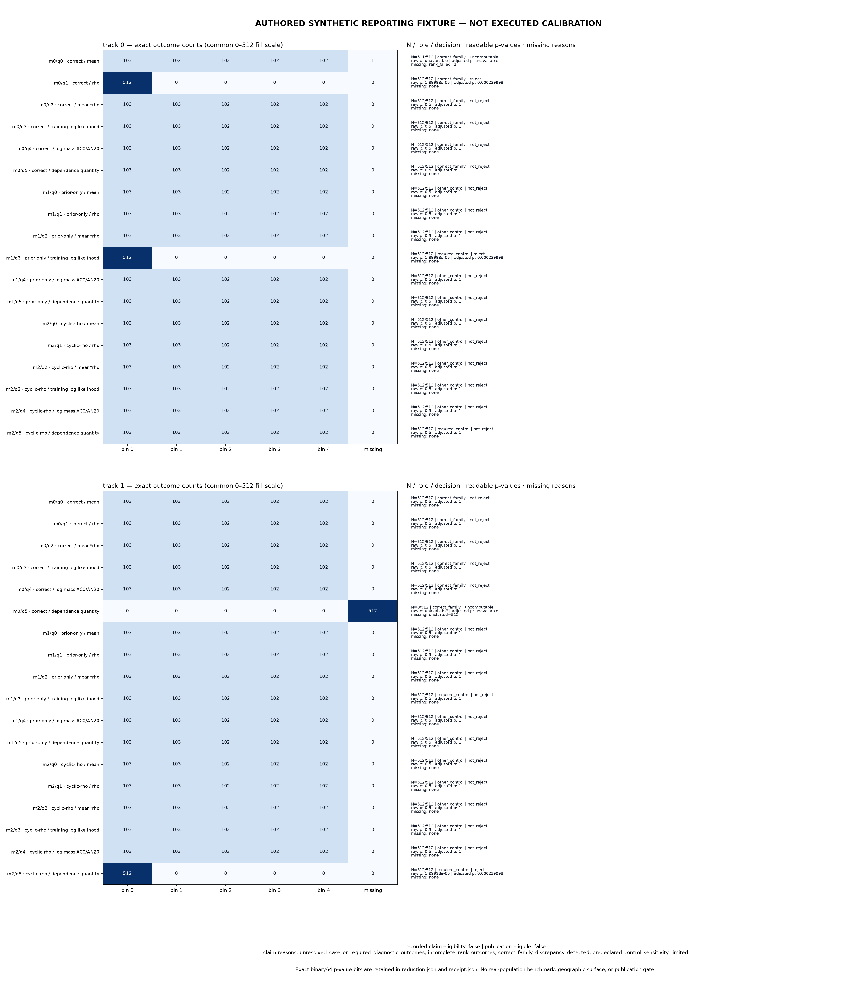
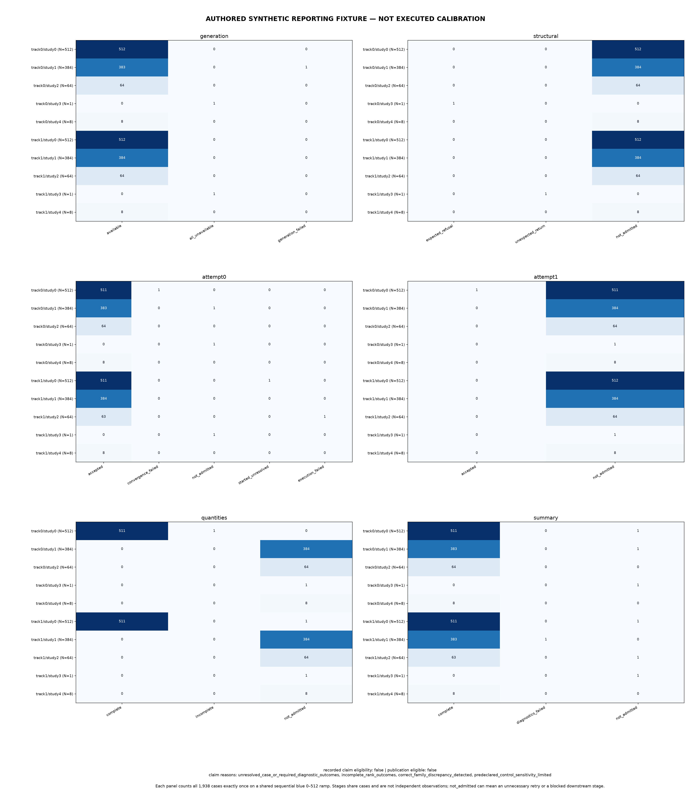

# B0H calibration report

This offline report makes a frozen B0H reduction reviewable. It displays rank outcomes and full
case accounting without rerunning a fit, simulation, rank test, or scientific decision. The input
must be the exact canonical bytes produced by the existing reduction workflow, and its expected
SHA-256 must come from the separately verified collection/reduction process.

The committed figures below are an authored synthetic reporting fixture. They demonstrate the
report format and its refusal states; they are not an executed calibration, a real-population
prediction benchmark, a geographic surface, or evidence for publication. Their fixture is
constructor-valid by design, but that does not make its rank tests observed results.





## Reproduce the authored demonstration

Run these commands from the repository root with the existing locked environment. The explicit
`PYTHONPATH` prevents a shared editable environment from importing another checkout. The cache
locations keep local compiler and plotting state outside the repository.

```bash
PYTHONPATH=. PYTHONDONTWRITEBYTECODE=1 \
PYTENSOR_FLAGS=base_compiledir=/private/tmp/genomeos-calibration-report-cache-20260911/pytensor-base,compiledir=/private/tmp/genomeos-calibration-report-cache-20260911/pytensor \
MPLCONFIGDIR=/private/tmp/genomeos-calibration-report-cache-20260911/mpl \
XDG_CACHE_HOME=/private/tmp/genomeos-calibration-report-cache-20260911/xdg \
/Users/bschilder/code/genomeOS/.venv/bin/python \
scripts/build_calibration_report_demo.py \
--out .superpowers/sdd/2026-09-11-calibration-report/task-2-demo-reduction.json
```

The canonical authored reduction is 671,952 bytes with SHA-256
`a55cd9f3fca5c0ebd7eef2cc124d146f7b7a81a3ebd0a246cb940dec36aa8913`. Render it into a new
directory; the command refuses an existing destination.

```bash
PYTHONPATH=. PYTHONDONTWRITEBYTECODE=1 \
PYTENSOR_FLAGS=base_compiledir=/private/tmp/genomeos-calibration-report-cache-20260911/pytensor-base,compiledir=/private/tmp/genomeos-calibration-report-cache-20260911/pytensor \
MPLCONFIGDIR=/private/tmp/genomeos-calibration-report-cache-20260911/mpl \
XDG_CACHE_HOME=/private/tmp/genomeos-calibration-report-cache-20260911/xdg \
/Users/bschilder/code/genomeOS/.venv/bin/python \
scripts/plot_b0h_calibration.py \
--reduction .superpowers/sdd/2026-09-11-calibration-report/task-2-demo-reduction.json \
--expected-reduction-sha256 a55cd9f3fca5c0ebd7eef2cc124d146f7b7a81a3ebd0a246cb940dec36aa8913 \
--evidence-kind synthetic_fixture \
--out .superpowers/sdd/2026-09-11-calibration-report/task-2-demo-report-final
```

The generated directory contains an unchanged `reduction.json` copy, `ranks.png`,
`accounting.png`, and `receipt.json`. The receipt is written last. It records input and output
hashes, actual renderer/decoder/reducer source hashes, versions, every plotted value and label,
the supplied evidence kind, and the reduction's original claim eligibility and reasons. It always
sets `publication_eligible=false`. A receipt verifies report identity and internal replay; it does
not independently certify the upstream fit, provenance, p-values, or scientific acceptance.

For an eventual executed reduction, use the same plotting command with its independently verified
digest, a fresh output directory, and
`--evidence-kind executed_simulation_calibration`. Never relabel the authored demonstration as an
executed result.

## Read the rank figure

Each track has all 18 rows in frozen mode/quantity order. The six count columns are rank bins 0–4
and missing, share a 0–512 fill scale, and show exact integers. The metadata beside each row gives
`actual_n/512`, its frozen role and decision, readable recorded raw and Bonferroni-adjusted
p-values, and any missing-outcome reasons. Exact binary64 p-value bits remain in the canonical
input and receipt.

Mode IDs are `0=correct`, `1=prior-only`, and `2=cyclic-rho`. Quantity IDs are `0=mean`, `1=rho`,
`2=mean*rho`, `3=training log likelihood`, `4=log mass AC0/AN20`, and `5=dependence quantity`.
Correct-family rejection, required-control detection, other controls, and uncomputable rows retain
their distinct roles. A missing row is never displayed as a zero-valued full-N test.

## Read the accounting figure

The generation, structural, attempt0, attempt1, quantities, and summary panels each count every
original case exactly once. Each panel therefore totals 1,938. Within each track, the fixed study
denominators are study0=512, study1=384, study2=64, study3=1, and study4=8. Columns use the literal
statuses retained by the reduction; no status is renamed or silently dropped.

The six stages describe the same cases and are not independent observations. `not_admitted` is an
explicit state, not automatically a failure: it can identify an unnecessary retry or a downstream
stage blocked by an earlier outcome. The claim footer repeats the reduction's eligibility and all
reasons without manufacturing a positive finding.
