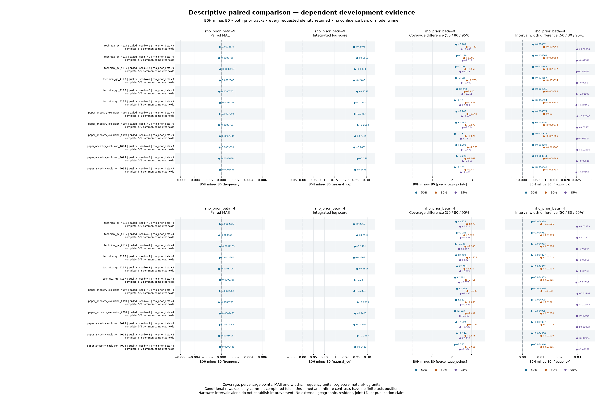

# Population-aware reference-count benchmark, September 22, 2026

## TL;DR

A model that allows allele frequencies to differ between source populations predicted held-out
counts better than a model that pools every population together. The improvement appeared in every
one of the 24 matched comparisons for the main probability score and the average absolute error.
However, the population-aware model made already-conservative uncertainty intervals even wider, so
it is useful evidence for the *mechanism* but is not ready to replace the current baseline.

This is dependent development evidence from linked variants and reused source populations. It is
not an external replication, a geographic model, or a release decision.

Each row in the figure is one predeclared combination of cohort filtering, count definition, and
random seed. The top row of panels uses the primary prior; the bottom row uses the wider sensitivity
prior. Every horizontal position is **B0H minus B0**: points to the right mean a larger value under
B0H, and points to the left mean a smaller value. There are no confidence bars because the source
populations and linked variants do not provide independent replication.

## What was compared

`B0` pools the reference populations. `B0H` adds explicit between-population variation while keeping
variants independently parameterized. Both models were evaluated on the same five held-out folds.
The completed matrix contains:

- two cohort definitions: the 4,117-person technical-quality cohort and the 4,094-person cohort
  after the paper's ancestry exclusion;
- two count definitions: called-allele counts and quality-filtered allele counts;
- random seeds 42, 43, and 44; and
- the primary `Beta(1, 9)` prior and a wider `Beta(1, 4)` sensitivity prior for population
  variation.

All 24 requested pairs completed. Each run scored 40,797 of 40,800 rows; the same three rows were
explicitly unavailable rather than imputed. The weighting unit is a source-population group, not an
independent study.

## Main result

Under the primary prior, the population-aware model improved the integrated log score in all 12
matched comparisons. The median improvement was **+0.2454 natural-log units**, with a range of
**+0.2406 to +0.2583**. Mean absolute error also improved in all 12 comparisons: the median change
was **-0.000293 allele-frequency units**, ranging from **-0.000375 to -0.000220**.

RMSE was essentially neutral and inconsistent. Its median matched-pair change was **-0.000006**, but
the range was **-0.000037 to +0.000297**. This prevents a simple claim that every point-prediction
measure improved.

The uncertainty intervals became substantially wider. Median within-pair increases were 0.00486,
0.00988, and 0.02519 allele-frequency units for the 50%, 80%, and 95% intervals. That increased
coverage by 2.20, 2.67, and 2.47 percentage points, respectively, but the absolute coverage values
show that these increases made calibration worse:

| Nominal interval | Median B0 coverage | Median B0H coverage | B0 distance above target | B0H distance above target |
|---|---:|---:|---:|---:|
| 50% | 92.79% | 94.98% | 42.79 pp | 44.98 pp |
| 80% | 94.56% | 97.26% | 14.56 pp | 17.26 pp |
| 95% | 96.48% | 98.95% | 1.48 pp | 3.95 pp |

Both models are therefore over-conservative, especially at the 50% and 80% levels. A positive
coverage difference is not an improvement when the baseline already covers more often than the
nominal target.

## Prior sensitivity

The wider `Beta(1, 4)` prior reproduced the log-score and absolute-error signal: all 12 comparisons
improved, with median changes of +0.2412 and -0.000291, respectively. It was less attractive on the
remaining diagnostics. RMSE worsened in all 12 comparisons by a median 0.000123, and its 95%
intervals widened by a median 0.02965 rather than 0.02519 under the primary prior.

The `Beta(1, 9)` track is therefore the better of these two B0H specifications, but neither B0H
track is promoted. The useful next direction is to retain explicit population variation while
recalibrating the uncertainty model and testing it inside observation-aware spatial candidates. A
still-wider population-variation prior is not supported by this experiment.

## Scope and integrity

The comparison is descriptive. It does not estimate independent-locus uncertainty, resident
representativeness, geographic effects, joint linkage disequilibrium, or performance on an external
cohort. It makes no automatic model-winner or publication claim. A statistical-genetics reviewer
should check the population-exchangeability assumption, the interpretation of the count-calibration
target, and whether linked variants require a different validation unit.

The campaign used source revision `887c32c3724b97fc1c010c4b716f17039643b2db`. All three RunPod
shards were retrieved and checksum-verified before their pods were deleted. The comparison report
hash is `ff8190975d52269f0761f9c166bf1e28b0920a356d32b2cc96a70c5b074f031b`; the committed figure hash
is `03376267c210d902847d671e13ff08656c8bfa560f1a9bbe6f255aadc2fa1f95`. The plotting code is
[`scripts/plot_reference_comparison.py`](../../scripts/plot_reference_comparison.py).

The compact machine-readable summary is
[`b0h-reference-comparison-2026-09-22.json`](b0h-reference-comparison-2026-09-22.json). It contains
only aggregate metrics and integrity hashes. The 1.41 GB row-level paired report, posterior outputs,
and predictions remain private under
`data/research/b0h-comparison-v3r15-887c32c-20260920/` and are excluded from Git.
