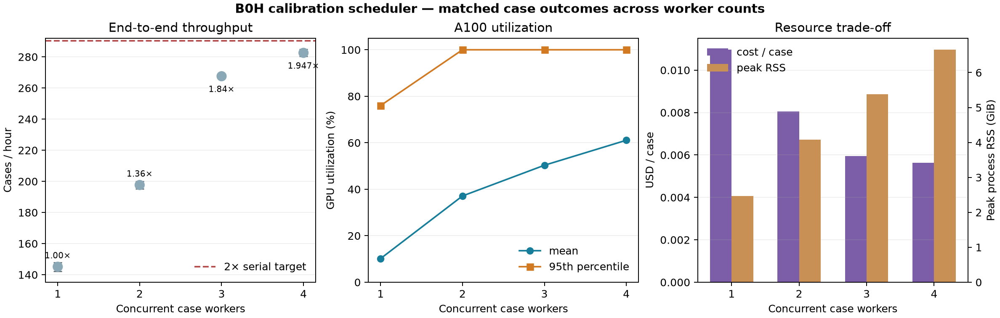
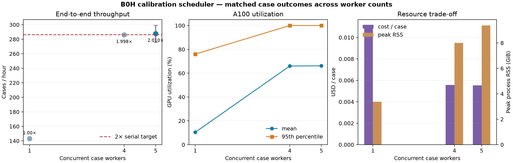
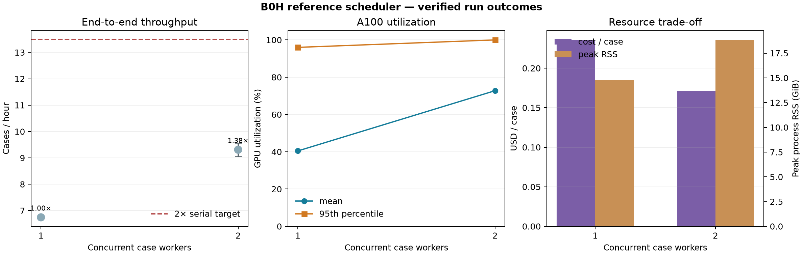

# B0H scheduler optimization evidence (2026-09-21)

Issue: [#337](https://github.com/bschilder/genomeOS/issues/337). The implementation is split
across PRs #353 and #354. This note reports engineering performance only; it makes no new
scientific claim about population heterogeneity.

## TL;DR

The old calibration runner processed one independent case at a time and left most of an A100 GPU
idle. The new runner keeps a measured, bounded number of case workers busy while one coordinator
remains the only process allowed to write the evidence database. Five workers are the measured
default for calibration; `--workers 1` retains the original serial behavior. The default is
supported by the repeated 32-case confirmation below, rather than by the smaller exploratory
matrix.

## Claim and acceptance boundary

The operational claim is that independent frozen B0H cases can run concurrently without changing
case identities, completion/failure classifications, completion digests, inventory, or reduced
scientific bytes. The implementation must retain exactly-once publication after process loss,
duplicate delivery, pending publication, and restart. The measured default must achieve at least
2× end-to-end throughput on representative calibration work without increasing cost per case.

The scheduler separates each stage into preparation, scientific execution, and publication.
Long-lived spawned processes perform science. They write an immutable, checksummed publication
packet to a durable spool; the parent is the sole SQLite owner and publishes that packet. At
startup, the parent replays any complete spooled packet before admitting more work. Every process
sets `OMP_NUM_THREADS`, `MKL_NUM_THREADS`, `OPENBLAS_NUM_THREADS`, and `NUMEXPR_NUM_THREADS` to one
before importing numerical libraries, and admission binds those settings into the runtime digest.

## Correctness evidence

The fixed-clock deterministic fixture compares serial and concurrent runs case by case. It proves
identical case order, stage classifications, completion digests, complete inventory digest, and
final reduction bytes. Separate real-spawn tests cover worker bootstrap and thread caps. Fault
tests cover a lost worker, draining already-active results, duplicate packet delivery, packet
corruption, pending publication, owner restart, and recovered publication. Reduction continues to
refuse missing, conflicting, or ambiguous evidence.

The benchmark source was `e29164f444267af2ddacc879fa3a820c9d9b1892`. The mandatory smoke
suite, full pytest suite, Ruff, frozen-contract check, module-size check, and private-file gate
passed after setting the five-worker default. GitHub Actions verifies the pushed source separately.

## Repeated 16-case scaling matrix

This matrix used one A100-SXM4-80GB, float64 JAX and CuPy, the locked package set, two repeats per
worker count, and 16 fixed cases spanning all five studies and both tracks. Full workflow timing
includes process startup, compilation, every scientific stage, publication, and shutdown.

| Workers | Median seconds (range) | Speedup | Cases/hour | Mean GPU | Peak RSS | Peak threads | USD/case |
|---:|---:|---:|---:|---:|---:|---:|---:|
| 1 | 397.0 (389.3–404.8) | 1.00× | 145.1 | 10.2% | 2.47 GiB | 344 | $0.01096 |
| 2 | 291.4 (287.8–295.1) | 1.36× | 197.7 | 37.1% | 4.08 GiB | 665 | $0.00804 |
| 3 | 215.3 (215.2–215.3) | 1.84× | 267.6 | 50.3% | 5.38 GiB | 967 | $0.00594 |
| 4 | 203.8 (202.2–205.5) | 1.95× | 282.6 | 61.1% | 6.65 GiB | 1,274 | $0.00563 |

All eight runs produced the same case and stage classifications. Four workers cut cost per case by
49% and were fastest, but the median speedup was 1.947×. That is below the predeclared 2× gate, so
this matrix alone was not used to approve the default.



## Repeated 32-case confirmation

The 32-case confirmation repeated the one-, four-, and five-worker configurations twice on the
same fixed cases. It used every study and both tracks.

| Workers | Median seconds (range) | Speedup | Cases/hour | Mean GPU | Peak RSS | Peak threads | USD/case |
|---:|---:|---:|---:|---:|---:|---:|---:|
| 1 | 805.2 (802.8–807.7) | 1.000× | 143.1 | 10.4% | 3.38 GiB | 348 | $0.01111 |
| 4 | 403.0 (400.9–405.0) | 1.998× | 285.9 | 66.0% | 8.01 GiB | 1,307 | $0.00556 |
| 5 | 401.2 (384.9–417.5) | 2.010× | 287.6 | 66.2% | 9.37 GiB | 1,614 | $0.00554 |

Four workers remained just below the predeclared 2× gate. Five workers were the smallest measured
configuration that passed it, halving cost per case while matching the best measured throughput.
The runner therefore defaults to five workers and retains `--workers 1` as an explicit serial
mode. Five is the highest measured calibration count: the small gain from four to five came with
307 more threads and 1.36 GiB more resident memory, so choosing a higher default requires a new
resource measurement. An explicit higher worker count remains available and is frozen in the
campaign record.



## Heavy reference-workload boundary

A separate four-run reference comparison used larger real benchmark inputs to expose contention
that the small calibration cases cannot. At two workers, median wall time fell from 2,134.9 to
1,547.9 seconds (1.38×), mean GPU use rose from 40.4% to 72.8%, and cost per case fell 27.5%.
Three workers were not safe: one repeat completed in 1,614.4 seconds, while the other peaked at
81,142 MiB of the 81,920 MiB GPU and 1,767 threads before one subprocess exited unexpectedly. Its
receipt is `stopped_after_runner_failure`, and it is excluded from valid throughput aggregates.
Four workers were not launched into that observed memory ceiling. Reference comparisons should
therefore remain bounded at two workers even though calibration can use five.



## Numerical reproducibility boundary

Every real GPU process rehashes its retained scientific payload. Those raw digests differ across
all eight 16-case runs. Targeted probes also produced different raw digests in two independent
serial processes with identical seeds, hardware, source, thread caps, and `PYTHONHASHSEED`.
Independent NumPyro/NUTS GPU executions are therefore not bytewise reproducible in this runtime.

This does not relax the scheduler contract. Exact byte equality remains mandatory in the
deterministic fixture, where the scheduler is the only changed variable. The performance runs use
the same frozen case identities and require identical terminal case/stage classifications; raw
posterior digest diversity is reported separately and is never represented as equivalence.

## Reproduction and review artifacts

The committed JSON reports contain each included repetition, telemetry fingerprints, hardware
attestation, cost assumptions, corrected aggregate CPU samples, and the selection calculation.
Figures are generated by `scripts/plot_b0h_optimization.py`. Private case-level posterior and
reference artifacts remain outside Git; only performance summaries and figures are published.

```bash
python scripts/plot_b0h_optimization.py --kind calibration \
  --campaign <private-16-case-root> --cost-per-hour 1.59 --out <new-output-directory>
python scripts/plot_b0h_optimization.py --kind calibration \
  --campaign <private-32-case-root> --cost-per-hour 1.59 --out <new-output-directory>
python scripts/plot_b0h_optimization.py --kind reference \
  --campaign <private-verified-reference-root> --cost-per-hour 1.59 --out <new-output-directory>
```
