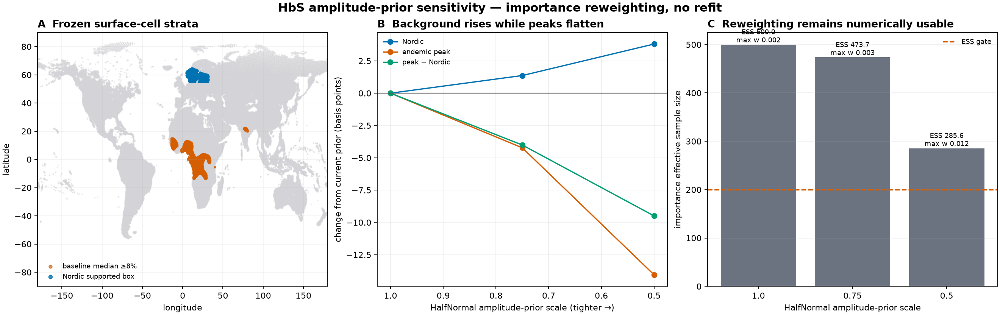

# HbS GP-amplitude prior sensitivity

**Date:** 2026-09-16

**Issues:** advances [#103](https://github.com/bschilder/genomeOS/issues/103) and
[#45](https://github.com/bschilder/genomeOS/issues/45)

**Design:** Atlas §§7–8; global AF plan WP2/WP4

**Evidence role:** development preflight; no refit and no publication-eligible surface

## Scientific contract

The canonical 994-survey HbS fit leaves a supported frequency near 1% in Scandinavia while its
endemic peaks are already too flat for Piel 2013 burden parity. Issue #103 names a tighter spatial
variance prior as a cheap possible remedy. The claim tested here is narrower: would replacing the
current `HalfNormal(1.0)` GP-amplitude prior with `HalfNormal(0.75)` or `HalfNormal(0.5)` move the
retained posterior toward a lower Nordic background without reducing the endemic-to-Nordic
contrast?

The measurable output is a self-normalized importance-reweighting sensitivity over the exact 500
posterior draws used for the global frequency artifact. A candidate is worth a full refit only if:

1. importance effective sample size is at least 200;
2. no draw receives more than 5% of normalized weight;
3. the population-weighted median frequency falls in the frozen supported Nordic box; and
4. the median contrast between frozen endemic-peak cells and the Nordic box does not fall.

The diagnostic strata were frozen before the result was computed. The Nordic box is 55–72°N and
4–32°E over `observed` or `interpolated` cells. The peak stratum contains supported cells whose
current posterior median is at least 8%. The [preregistration](hbs-amplitude-prior-sensitivity-2026-09-16/preregistration.json)
binds the thresholds and all four private input hashes.

## Method

For each retained posterior amplitude draw `a`, changing the HalfNormal scale from `s0` to `s1`
gives the unnormalized log weight

```text
log(s0 / s1) - 0.5 * a² * (1 / s1² - 1 / s0²).
```

The implementation normalizes these weights after subtracting their maximum, calculates Kish
effective sample size, and summarizes the draw-aligned intercept and frequency fields with weighted
quantiles. Both geographic strata are reduced in one matrix multiplication. The same 500 draw
indices bind amplitude, intercept and all 77,844 surface-cell columns; no independent field is
resampled or paired by row position after the fact.

The result is an importance sensitivity, not an equivalent refit. It keeps the likelihood and
posterior support of the current fit and cannot establish held-out count score, calibration, golden
parity or model promotion.

## Result

Both tighter candidates pass the numerical reliability gate, but both move the field in the wrong
scientific direction.

| Amplitude prior scale | Importance ESS | Maximum weight | Nordic median | Peak median | Peak − Nordic median | Advance to refit |
|---:|---:|---:|---:|---:|---:|:---:|
| 1.00 | 500.0 | 0.0020 | 0.9843% | 10.9717% | 9.9281 pp | reference |
| 0.75 | 473.7 | 0.0034 | 0.9979% | 10.9294% | 9.8880 pp | no |
| 0.50 | 285.6 | 0.0118 | 1.0223% | 10.8311% | 9.8331 pp | no |

At scale 0.75 the Nordic background rises by 1.36 basis points while the peak falls by 4.23 basis
points. At scale 0.5 the background rises by 3.80 basis points while the peak falls by 14.05 basis
points. The reference-prior intercept frequency is 0.9938%; it rises to 1.0092% and 1.0336% under
the two tighter priors. The posterior compensates for reduced spatial amplitude by increasing its
global intercept, worsening the exact background/peak failure this option was meant to fix.



Panel A shows the diagnostic surface cells in their actual geography; it does not overlay measured
observations. Panel B reports change from the current prior in basis points, making the small but
consistent wrong-way movement visible. Panel C shows that rejection is scientific rather than a
collapsed-weight artifact.

## Decision and implications

Do not spend a full GPU fit on these two tighter amplitude priors. This closes the cheap
variance-prior route named in #103 for the current model: the problem is not solved by globally
shrinking the stationary field. It strengthens the case for a model that can represent a low
background and localized positive departures separately. That next model remains independently
scoped and must be selected on held-out count prediction before Piel parity is inspected as a final
gate.

This result does not reject every conceivable amplitude prior, prove that the current prior is
optimal, or qualify a local/nonstationary replacement. It uses no MAP environmental product,
Earth Engine layer or other covariate.

## Reproduction and retained evidence

Run from the repository root with the four hash-bound private artifacts named by the
preregistration:

```bash
MPLCONFIGDIR=/tmp/genomeos-amplitude-mpl PYTHONPATH=. python \
  scripts/preflight_hbs_amplitude_prior.py \
  --fit <private-fit.pkl> \
  --draw-manifest <private-draws-manifest.json> \
  --frequency-draws <private-frequency-draws.npy> \
  --cells <private-cells.parquet> \
  --preregistration docs/research/hbs-amplitude-prior-sensitivity-2026-09-16/preregistration.json \
  --out <new-output-directory>
```

Tracked aggregate evidence:

- [result JSON](hbs-amplitude-prior-sensitivity-2026-09-16/result.json), SHA-256
  `11cdea69f7b63babf153fcd65840eb7d24c38b18734fc4801f3befdcdc28a15a`;
- [figure](hbs-amplitude-prior-sensitivity-2026-09-16/amplitude-prior-sensitivity.png),
  SHA-256 `282aebf5ea7c854ed638b4ab82cbbdfb332c613afb3cbce42cbe3cef0eae36f6`;
- preregistration SHA-256
  `d38afa8e2246de7610af3dd12324a32cf4d26fdb159a3dfc1a999654a3626ecd`.

The private fitted model and 500 × 77,844 frequency array remain untracked; this preflight commits
only the aggregate result, its preregistration, and its rendered figure. The result records
`scientific_acceptance=false`, `publication_eligible=false`, and
`environmental_covariates_used=false`.
