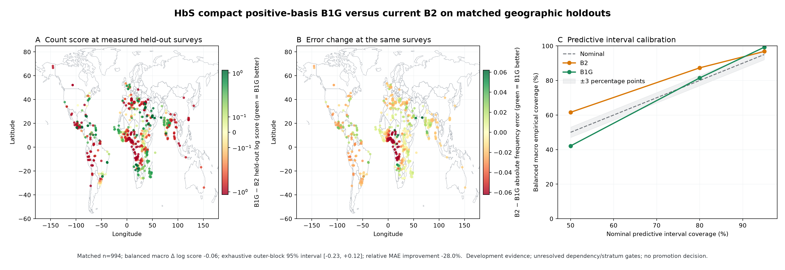

# Compact positive-basis HbS benchmark, September 23, 2026

## TL;DR

The compact positive-basis model did not beat the current spatial GP on the same 994 held-out HbS
surveys. Its average absolute error was **28.0% worse**, its probability score was slightly worse,
and the uncertainty interval around that score difference included both improvement and harm. It
helped the probability score for positive-count surveys, but it performed much worse at zero-count
surveys—the exact tradeoff it was designed to fix.

This rejects the registered B1G candidate as a replacement for the current B2 model. It does not
reject every nonstationary or locally adaptive spatial model.

Panels A and B use circles at measured held-out survey coordinates. They show B1G minus B2
predictive differences rather than an inferred allele-frequency surface. Green means B1G performed
better and red means it performed worse. Panel C compares balanced macro predictive coverage with
the nominal 50%, 80%, and 95% targets.

## What was tested

B1G combines a low global background with a nonnegative mixture of compact C2 Wendland basis
functions. The candidate grid was frozen before fitting:

- radii of 500, 1,000, and 2,000 km;
- 8, 16, and 32 training-only basis centres;
- five dependency-aware outer geographic folds and exactly three training-only inner folds;
- the unchanged beta-binomial observation model, cohort/design effects, priors, 300 km buffer,
  held-out rows, and count-predictive diagnostics used by the B0 and B2 benchmarks; and
- one prespecified convergence retry with twice the tuning and draw budget.

Every outer fold completed and every final outer fit passed the registered convergence gate with
zero divergences. The selected configurations were:

| Outer fold | Selected radius | Selected bases | Held-out surveys |
|---:|---:|---:|---:|
| 0 | 500 km | 16 | 215 |
| 1 | 2,000 km | 16 | 232 |
| 2 | 500 km | 16 | 168 |
| 3 | 2,000 km | 16 | 240 |
| 4 | 500 km | 16 | 139 |

The basis count was stable, but the radius was not. Only 16 of the 45 outer-fold candidate cells
completed all three inner folds; 69 inner fits used their one allowed retry. Those failures remained
in the artifact and could not win selection.

## Primary result against current B2

The comparison uses the same 994 held-out survey rows for both models and averages surveys within
declared cohort/region cells before giving the five represented cells equal weight.

| Metric | B1G | B2 | B1G change |
|---|---:|---:|---:|
| Balanced macro log score | -4.61698 | -4.55285 | -0.06414 |
| Balanced macro MAE | 0.04198 | 0.03281 | **28.0% worse** |
| Balanced macro RMSE | 0.05284 | 0.04587 | 0.00697 worse |
| 50% interval coverage | 42.13% | 61.58% | -19.45 pp |
| 80% interval coverage | 81.46% | 87.31% | -5.85 pp |
| 95% interval coverage | 99.24% | 96.79% | +2.45 pp |

The exhaustive 3,125-resample outer-block interval for the log-score difference was
**[-0.22623, +0.11817]**. Four of the five primary block estimates were negative. Only the 80%
coverage level fell within the prespecified three-percentage-point calibration tolerance; 50% and
95% coverage failed. Every geographic fold had worse mean absolute error under B1G.

B1G easily improved probability score over the pooled B0 baseline, by +316.38 natural-log units,
but B0 is not the strongest eligible comparator. B1G's absolute error was also about 1.0% worse than
B0. The registered decision rule requires beating B2, so the B0 comparison cannot rescue the
candidate.

## The mechanism failed at zero-count surveys

The separate count strata show why the global result is negative:

| Held-out stratum | Surveys | Log-score change | B1G MAE | B2 MAE | MAE change |
|---|---:|---:|---:|---:|---:|
| Positive count | 777 | +0.08840 | 0.04567 | 0.03985 | 0.00581 worse |
| Zero count | 217 | **-0.48692** | 0.02341 | 0.01177 | **0.01164 worse** |

The compact positive residual recovered some probability mass around endemic positive counts, but
it did not suppress non-endemic background. Zero-count absolute error nearly doubled. Increasing
the radius or basis count after seeing this result would violate the frozen grid and would recreate
the broad-smearing risk that motivated the experiment.

## Decision and next direction

Do not promote B1G, widen its basis radii, tune its priors from these outcomes, or use additional
random seeds to select a favorable result. Seed 42 was the registered primary comparison. Issue
[#382](https://github.com/bschilder/genomeOS/issues/382) records the matched-baseline rule for any
future multi-seed sensitivity analysis and explicitly forbids sensitivity seeds from rescuing a
failed primary result.

The evidence continues to support observation-aware spatial modeling: B2 remains much better than
the pooled B0 probability model. The next spatial candidate should address local adaptation or
nonstationarity without transferring probability from zero-count regions to endemic peaks. It must
still use unchanged count holdouts, report zero and positive strata separately, and beat B2 rather
than B0. Independent variants and sealed external confirmation remain required before any model
promotion.

## Scope and integrity

This is dependent development evidence. Dependency review remains `not_checked`, geographic
assignments remain `algorithmic_development_unreviewed`, and the adequately powered subgroup rule
in [#371](https://github.com/bschilder/genomeOS/issues/371) remains undefined. The report therefore
keeps `publication_eligible=false` and `scientific_promotion_decision=not_made`.

The campaign used source revision `d11770551234e7899f7a9ab7da2cd29a9772a077`. All five terminal
fold shards and logs were checksum-verified before every task-owned RunPod was deleted. The final
result archive SHA-256 is `7670abe520c683fae6a21889fae1a2251f4b7d39a83c5d8b6d3ad20a8256b3e2`.
The committed comparison report hash is
`8fb790946115f375db425d7e70066752dc206bdcbf14c5eead7357b1e83182e9`; the figure hash is
`6eb7e399798d0cfbdc5def59ee219c1fe97ffd3078229fbdd95af349a9f46b8c`.

The plotting code is [`scripts/plot_hbs_b1g_benchmark.py`](../../scripts/plot_hbs_b1g_benchmark.py).
The compact machine-readable report is
[`hbs-b1g-comparison-2026-09-23.json`](hbs-b1g-comparison-2026-09-23.json). It contains aggregate
metrics and immutable identities. Observation-level predictions, checkpoint shards, logs, and the
four-file input bundle remain private and untracked.
