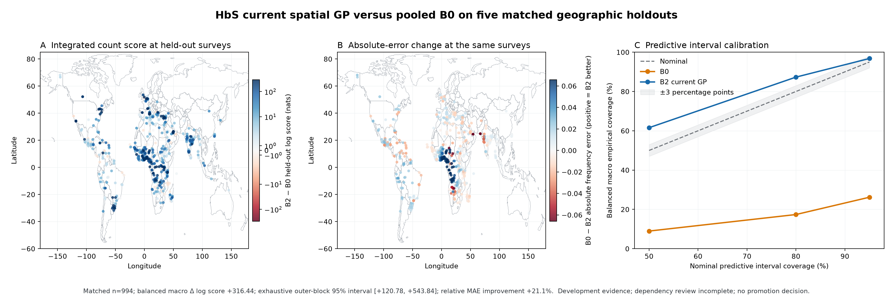

# HbS current spatial-GP benchmark, September 17, 2026

This is a matched development comparison of the current single-variant spatial GP (`B2-current`)
against the pooled Beta-binomial-free baseline (`B0`). It implements the reduction frozen in
[issue #189](https://github.com/bschilder/genomeOS/issues/189#issuecomment-5705882045) while only two
of five B2 folds existed and before their predictive values were inspected. It is observational
research evidence, not a publication or production promotion.

## Result

All five dependency-buffered outer folds completed and emitted the exact 994 held-out rows expected
from the matching B0 artifact. B2 improves the balanced macro integrated log score by **316.44 nats**;
the exhaustive paired five-block interval is **[120.78, 543.84]**. Every one of the five block
estimates is positive. Balanced macro MAE falls from **0.04156 to 0.03281**, a **21.1% relative
improvement**, and RMSE falls from 0.05864 to 0.04587.

| Balanced macro metric | B0 | B2 current GP | B2 change |
|---|---:|---:|---:|
| Mean integrated log score | -320.997 | -4.553 | +316.445 |
| MAE | 0.04156 | 0.03281 | 21.1% lower |
| RMSE | 0.05864 | 0.04587 | 0.01277 lower |
| 50% coverage | 9.0% | 61.6% | +52.6 pp |
| 80% coverage | 17.4% | 87.3% | +69.9 pp |
| 95% coverage | 26.2% | 96.8% | +70.6 pp |

The pooled B0 intervals are severely under-dispersed. B2 repairs most of that failure, but its 50%
and 80% intervals are now too wide: coverage is 11.6 and 7.3 percentage points above nominal,
respectively. Only 95% coverage, 1.8 points above nominal, meets the existing three-point tolerance.
This blocks promotion even though point prediction and integrated score improve strongly.

The result does not hide a zero-count regression. On 777 positive-count rows, mean log score improves
by 240.45 nats and MAE falls from 0.04722 to 0.03985. On 217 zero-count rows, mean log score improves
by 6.19 nats and MAE falls from 0.01699 to 0.01177. Four of five geographic folds improve row-weighted
MAE. The fifth changes from 0.03711 to 0.03791, a 2.1% relative degradation, which remains inside the
prespecified 5% regional tolerance. These row-weighted strata diagnose failure modes; the primary
estimand remains the declared-cohort/region balanced macro result.

## Interpretation and next direction

The present spatial, cohort and Beta-binomial observation model is a substantially stronger
development baseline than pooled B0. Spatial/observation-aware modeling is therefore promising, and
future candidates must beat B2 rather than claiming success against B0 alone. The hard local-support
B1 model remains rejected: its global primary emitted no rows, and its post-hoc wider support improved
positive counts while worsening zeros. The predeclared compact positive-residual B1G candidate in
[#331](https://github.com/bschilder/genomeOS/issues/331) remains a sensible next mechanism because it
targets that support/zero-count tradeoff, but it stays in Backlog until B0H is terminal and must beat
this completed B2 result on matched rows.

B2 itself is not ready for promotion. In addition to the intermediate-coverage failure, all five
NumPyro fits emitted an R-hat-above-1.01 warning and the final fit reported one post-tuning divergence.
The artifacts do not retain numerical R-hat/ESS values or per-fold convergence diagnostics. The
dependency review is `not_checked`, geographic assignments are
`algorithmic_development_unreviewed`, and the five-block interval is consequently development
evidence rather than certified dependency-aware uncertainty. No automatic winner or scientific
promotion decision is made.

## Identity and integrity

- Source revision: `d98794b18b64e230cbdbae8b23d37488a42de804`.
- Observations TSV: `820d725fae9859a6cebca98296676e8c525b103f7033aa5237b9aaa00f79b331`;
  observations Parquet: `466034e22015ce5f4e0b90067adb2232491b625591d50c8ac83d955565345b4b`.
- Assignments: `c922b240624c761f0752821d9e6986bb1479bbc97a0d9931da7db3a17ee20b20`;
  dependencies: `fa7b4c093dc2f83a2ea3c7f0810b9130e65feac7c94dc80fb8475d03c2d3cf22`;
  fit config: `349df9dac9655dfe56c67b369093b97f36a74800076ecd797cc777d075c43ada`.
- Terminal archive: `c41da195ca284bb91c24b0964ba72cf140265c7a2183dfe53e7178f091f13ea6`;
  final run log: `03d8fe39843df71afb30ec2e5c30319433fbb28efdf2adfd801c5d0b4e4c8a1c`.
- All five checkpoint artifacts passed their internal digest check and matched byte-for-byte between
  the pod and local storage. All 13 scientific/provenance files in the terminal archive matched the
  pre-archive checksum ledger and the retrieved copies; all five original inputs and the runner
  script matched their recorded hashes.

The generated `SHA256SUMS` includes a self-entry captured while that same file was being written, so
that one entry cannot validate the finished checksum file. Its recorded value is
`f88eeb50a1dca9eb72cfd2e5d148bf20f1937abf448b43a5b0738b639003a796`; the completed file is
`8e5786d3ed9282b1233c357261e43992e9b34420de7f2374550ef0fb411add71`. The independently written
archive receipt and every scientific member validate. This is a packaging defect, not a mismatch in
the model output, and must be removed from future launchers.

The compact machine-readable report is
[`hbs-current-gp-benchmark-2026-09-17.json`](hbs-current-gp-benchmark-2026-09-17.json). It omits
row-level predictions and cohort-level records. The private immutable artifacts remain under
`data/research/hbs-current-gp-benchmark-20260916-v2-checkpointed/` and are excluded from Git.
