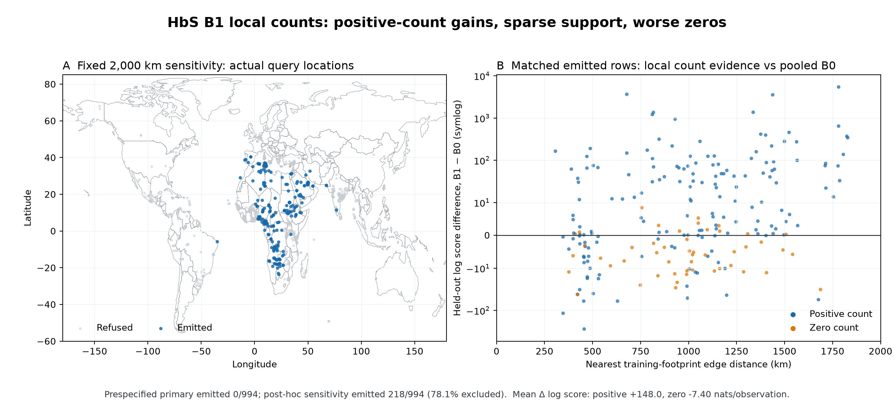

# HbS B1 local count benchmark

## Decision

The prespecified B1 local count smoother is **not a viable global comparator at the tested support
scales**. It correctly refuses unsupported geography, but that refusal covers the entire outer
benchmark after training-only bandwidth selection. A post-hoc fixed-2,000 km sensitivity finds a
large positive-count gain on a small supported subset, alongside worse zero-count prediction and
poor calibration. B1 is therefore not promoted. The useful part is the evidence that local count
structure exists; the hard compact-support estimator is too sparse and treats zero/background
behavior inadequately.

## Scientific contract

**Objective.** Test whether local count evidence plus explicit refusal can preserve HbS endemic
signal and suppress unsupported background without the global probability transfer diagnosed in
issue #103.

**Output and acceptance evidence.** Score held-out AC conditional on AN on the same immutable
five geographic folds as B0 and the attempted current-GP B2 run. Retain every refusal; report
requested/emitted counts, exact count scores, calibration, interval widths, zero/positive strata,
and matched B0 results. Bandwidth selection must see outer-training data only.

**Component and interface.** `genomeos.validation.local_count` implements a vectorized spherical
triweight weighted-count power posterior. `local_count_selection` runs the finite training-only
bandwidth comparison. `local_count_benchmark` keeps outer folds, predictions, and support ledgers
separate. `scripts/benchmark_local_count.py` is the offline artifact adapter.

**Assumptions and refusals.** Footprint-edge great-circle distance defines proximity. A query needs
at least two in-band training observations and 100 kernel-weighted alleles. Weighted counts are a
generalized-Bayes power likelihood, not literal fractional sampled alleles. There is no B0 or
prior-only fallback. No environmental/pathogen covariate or publisher identity enters the model.

## Inputs and qualification

The three input hashes exactly match the frozen 994-row HbS B0/B2 benchmark:

| Input | SHA-256 |
|---|---|
| observations | `820d725fae9859a6cebca98296676e8c525b103f7033aa5237b9aaa00f79b331` |
| assignments | `c922b240624c761f0752821d9e6986bb1479bbc97a0d9931da7db3a17ee20b20` |
| dependencies | `fa7b4c093dc2f83a2ea3c7f0810b9130e65feac7c94dc80fb8475d03c2d3cf22` |

The assignments are `algorithmic_development_unreviewed`; the header-only dependency file is
`not_checked`. These results are observational research evidence, remain
`publication_eligible=false`, and do not make a promotion decision. MAP has no priority here: its
count-bearing HbS observations are used only because they are the already frozen Piel-comparable
benchmark. MAP environmental products are absent.

## Prespecified primary result

The primary run fixed `bandwidth_km = (500, 1000, 2000)`, Beta(1,1), 2,048 posterior draws, a
300 km geographic leakage buffer, at least two local rows, at least 100 effective alleles, and a
50% minimum inner emission fraction.

All five outer folds were infeasible and **0/994** held-out observations were emitted. This is a
scientifically valid refusal rather than a missing result. No candidate was eligible in any outer
fold:

| Bandwidth | Inner emission range across outer folds | Mean inner emission | Eligible outer folds |
|---:|---:|---:|---:|
| 500 km | 0.0%–0.26% | 0.15% | 0/5 |
| 1,000 km | 3.57%–7.75% | 4.90% | 0/5 |
| 2,000 km | 9.14%–26.27% | 17.16% | 0/5 |

The primary conclusion is not that local frequency is absent. It is that compact local evidence
at these scales cannot support a global geography-blocked comparison on this observation layout.

## Explicit post-hoc sensitivity

After seeing the primary refusal, a separate artifact fixed the 2,000 km candidate and removed the
50% inner-emission gate. Its manifest labels `analysis_role=posthoc_sensitivity`; it cannot rescue
or replace the primary result.

The sensitivity emitted **218/994** rows (21.9%), excluded 78.1%, completed four folds, and emitted
nothing in one fold. Refusals were 665 for insufficient local rows and 111 for insufficient
effective alleles.

On the exact emitted subset:

| Metric | B1 local count | Matched B0 |
|---|---:|---:|
| Macro mean count log score | −87.17 | −206.76 |
| Macro MAE | 0.0498 | 0.0478 |
| Macro RMSE | 0.0607 | 0.0691 |
| 95% predictive coverage | 37.1% | 23.4% |
| 95% interval width | 0.0499 | 0.0187 |

Both arms remain severely under-covered. B1 obtains better log score by widening intervals and
placing more probability near locally supported positive counts; it does not achieve calibration.
Macro MAE is slightly worse even though RMSE improves.

The zero/positive split is decisive:

| Stratum | Rows | Mean Δ log score, B1−B0 | B1 MAE | B0 MAE | B1 / B0 95% coverage |
|---|---:|---:|---:|---:|---:|
| Positive AC | 169 | **+148.03** | 0.0358 | 0.0644 | 55.6% / 18.3% |
| Zero AC | 49 | **−7.40** | 0.0531 | 0.0136 | 26.5% / 61.2% |

The row-weighted mean gain is +113.09 nats per emitted observation, but it is not a global estimate:
the subset was selected by post-hoc support and omits 776 rows. The figure therefore maps every
requested location and marks emissions directly instead of presenting a fitted heatmap.

## Interpretation and next direction

The strong positive-count gain is evidence for geographically local HbS structure that B0 erases.
The sparse support and zero regression reject this hard local smoother as the next production
model. Extending the bandwidth until it covers the globe would simply recreate global smoothing
and weaken the refusal that made B1 scientifically honest.

The next promising statistical direction is a nonstationary or gated spatial model that can
represent local endemic peaks while shrinking non-endemic background toward zero, without labeling
observed zeros as structural absence. It must beat B0 on positive and zero rows separately, retain
explicit unsupported states, and pass the same frozen geographic folds. A local smoother may
remain a component or diagnostic inside that model, but not the global estimator in its current
form.

The current-GP B2 arm has no valid full comparison: the controlled run hit its three-hour cutoff
before all folds completed. Its partial output is not used to rank B1.

## Reproducibility

The full primary and sensitivity artifacts are private untracked research outputs because they
contain the 994-row count benchmark. They live at:

- `data/research/hbs-local-count-benchmark-20260916-primary-v1/`
- `data/research/hbs-local-count-benchmark-20260916-posthoc-2000km-v1/`

The aggregate machine-readable report is
`docs/research/hbs-local-count-benchmark-2026-09-16.json`. The figure is regenerated by
`scripts/plot_hbs_local_count_benchmark.py`; it renders measured query locations and matched score
differences only, never an inferred surface.
