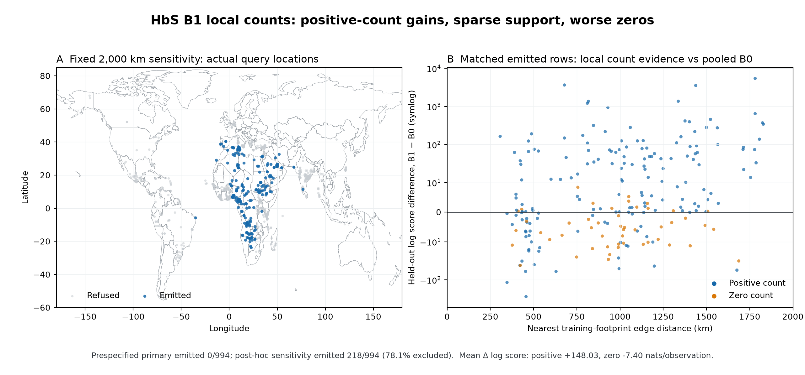

# HbS B1 evidence follow-up, version 2 — 2026-09-20

The original September 16 result is unchanged: the prespecified B1 model emits 0/994 held-out observations; the post-hoc 2,000 km sensitivity emits 218/994. This follow-up verifies the retained evidence more strictly and adds descriptive denominator and distance strata. It does not refit a model, alter a threshold, qualify a surface, or close issue #307.

The [original frozen note](hbs-local-count-benchmark-2026-09-16.md), JSON and figure remain unchanged. The [version 2 aggregate report](hbs-local-count-benchmark-2026-09-20-v2.json) and the figure below are separate outputs.

## Evidence boundary

The reader verifies SHA-256 and byte length for the supplied observations and every required output in all three artifact directories. It refuses incomplete inventories, incompatible schema/model/role/nonpublication records, inconsistent configuration and split hashes, wrong split membership, missing or extra support/prediction keys, mismatched counts and cohort/region/variant identities, and contradictory status or candidate ledgers. Coordinates cover every requested observation exactly once. B1 and B0 summaries are replayed from retained rows with relative tolerance 1e-12 and absolute tolerance 1e-14, including explicit negative-infinite scores. Hashes establish byte identity; semantic checks establish internal consistency, not independent scientific qualification.

The public B1 finalizer rebuilds the plan from its frozen inputs and checks each terminal fold before aggregation. Emitted and refused IDs must uniquely partition the requested IDs; refused rows require a reason and a null posterior; predictions must cover exactly emitted IDs and match retained support and observed counts. The runner repeats this validation before creating its output directory. Failed and infeasible folds remain terminal, visible, and unscored. B1 has no checkpoint/resume interface; this change does not add one.

## Post-hoc denominator and distance strata

These bins were added after inspecting the retained result and are **post-hoc descriptive**, not prespecified selection or promotion gates. Denominator means observed allele count AN. Distance means nearest training-footprint edge distance in kilometers, already retained by B1. Intervals include their upper boundary. Counts include every requested observation; score and coverage columns use emitted rows paired with the identical B0 rows. No missing distance is imputed. The primary has 994 refusals and no retained distance after bandwidth selection was infeasible; all primary distance entries therefore remain explicitly unavailable.

### Observed denominator

| Stratum | Requested | Emitted | Refused | Emission % | B1 95% coverage | B0 95% coverage | Mean B1 − B0 log score |
|---|---:|---:|---:|---:|---:|---:|---:|
| 1–100 | 84 | 17 | 67 | 20.2 | 64.7% | 76.5% | +0.81 |
| 101–1000 | 674 | 146 | 528 | 21.7 | 50.0% | 29.5% | +20.37 |
| 1001–10000 | 180 | 50 | 130 | 27.8 | 40.0% | 10.0% | +177.24 |
| >10000 | 56 | 5 | 51 | 8.9 | 60.0% | 0.0% | +2560.70 |

### Distance to training support (km)

| Stratum | Requested | Emitted | Refused | Emission % | B1 95% coverage | B0 95% coverage | Mean B1 − B0 log score |
|---|---:|---:|---:|---:|---:|---:|---:|
| 0–500 | 44 | 43 | 1 | 97.7 | 30.2% | 37.2% | +0.27 |
| >500–1000 | 71 | 63 | 8 | 88.7 | 39.7% | 27.0% | +134.40 |
| >1000–2000 | 282 | 112 | 170 | 39.7 | 61.6% | 25.0% | +144.42 |
| >2000 | 597 | 0 | 597 | 0.0 | unavailable | unavailable | unavailable |

The aggregate JSON also retains primary-arm strata, zero/positive strata, refusal reasons, matched errors, and explicit infinite/undefined paired-score counts. Nonfinite paired differences are not silently averaged away; unavailable means are null with a reason. The figure retains every geographic query and labels any paired score that cannot be drawn on finite axes.

## Acceptance items still open

**Endemic peak and non-endemic background strata are unavailable/not reviewed.** No existing reviewed, outcome-independent definition was found in the benchmark specifications or implementation. Held-out AC is not used to invent endemic labels. Zero/positive count strata answer a different question and do not complete this acceptance item. A reviewed definition or explicit issue rescoping is still required.

**A qualified matched B2 comparison is unavailable.** The original “three-hour cutoff” statement describes only `hbs-current-gp-benchmark-20260916-v1-partial`, dated September 16. The later [September 17 completed development comparison](hbs-current-gp-benchmark-2026-09-17.md), introduced by [PR #332](https://github.com/bschilder/genomeOS/pull/332), contains all 994 rows but lacks retained numerical per-fold convergence diagnostics and reports a post-tuning divergence; calibration gates also fail. An R-hat >1.01 warning alone does not establish failure of the frozen 1.05 threshold. The missing diagnostics and recorded divergence prevent qualifying that old result, and the later prospective code repair does not retroactively qualify it. Version 2 links and hashes the later report separately from the dated interrupted-run statement.

The B1 reader establishes exact B0 pairing. It does not combine B1 with the unqualified B2 artifact or imply that completed predictions satisfy convergence gates. A new artifact with passing retained diagnostics and reviewed exact input/split identities is needed before a qualified B1/B2 comparison can be made. Independent scientific confirmation, count/calibration gates, and any later burden parity remain unsatisfied. This PR **advances #307**; it does not complete it.

## Reproduction

Run `scripts/plot_hbs_local_count_benchmark.py` with the original observation TSV and the frozen primary, sensitivity, and B0 directories, and new `--report` and `--out` paths. Existing files, symlinks, aliased destinations and nested destinations are refused before creating either output. Complete temporary outputs are published with atomic no-replacement links; a failure at the second publication removes only the first link created by this invocation, preserving competing evidence. The JSON records all three retained manifest hashes, the observation/assignment/dependency hashes, and the hash of the later B2 report. Full row-level artifacts remain private and untracked; no restricted source rows are added to the repository.
