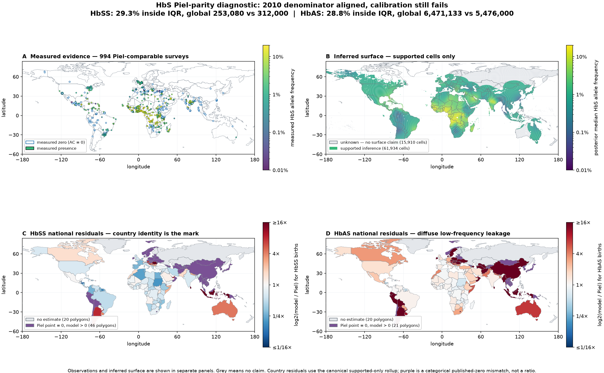

# HbS parity acceptance run — 2026-09-16

**Status:** failed publication gate, with a corrected reference-year denominator. This advances
[#45](https://github.com/bschilder/genomeOS/issues/45); it does not close it. The denominator bug
and permanent fix are [#300](https://github.com/bschilder/genomeOS/issues/300).

## Scientific contract

**Objective.** Reproduce Piel et al. 2013 national annual HbAS and HbSS neonatal estimates from
the declared Piel-comparable HbS surveys, a fitted geostatistical surface, population-weighted
birth denominators, and draw-wise burden propagation.

**Acceptance evidence.** For both HbAS and HbSS: at least 80% of national point estimates inside
the published IQR, at least 95% interval overlap, and a global posterior median inside the
published global IQR. The canonical aggregation excludes `unknown` and `prior_dominated` cells.

**Engineering path.** MAP survey adapter → beta-binomial inducing-point GP → 500 coherent global
posterior rows → WorldPop within-country weights aligned to Piel's 2010 national populations →
Piel country crude birth rates → autosomal-recessive carrier/affected expressions → parity scorer.

**Assumptions and refusals.** Piel's 2010 country population is the national total; WorldPop 2020
is used only for within-country spatial weighting. This assumes the 2020 settlement pattern is an
adequate spatial proxy for 2010, and records that approximation. Cells outside the Natural Earth
country geometry and countries absent from Piel receive no silent fallback. The comparison reuses
Piel's survey corpus and is therefore a golden integration/calibration test, not independent
external validation.

## Frozen inputs and fit

The source fit used repository commit `6c1b051209b48ddc251a4cf1672ee7891446e7dd` and the exact
environment in `requirements.lock`:

| Item | Value |
|---|---:|
| Raw MAP HbS CSV SHA-256 | `ab92edd3059aa59a37f3e2d10361d67e490c573fc3c03bf13eb902e3820e98fd` |
| Normalized observation SHA-256 | `8694b1bcb2f25cb7158d31229dc17dbab430e13e021df96ce2a5c6eb304a4533` |
| Retained surveys / cohorts | 994 / 385 |
| Alleles / alternate alleles | 11,359,130 / 175,878 |
| Fit SHA-256 | `004d6d3cd71cff861968cb091bbd9e97cd8b3a7548c1c9d10491b5da9d5c2a78` |
| Observation parquet SHA-256 | `466034e22015ce5f4e0b90067adb2232491b625591d50c8ac83d955565345b4b` |
| Model | beta-binomial sparse GP, 150 H3 inducing points, cohort random effect |
| Sampling | 4 chains × 1,200 retained draws after 1,200 warmup; NumPyro; seed 42 |
| Fitted correlation range | 715.25 km |
| Fit time | 538.36 s on one A100 80 GB PCIe |
| Worst R-hat / minimum ESS | 1.0059 (`beta_cohort`) / 767.6 (`lengthscale`) |
| Divergences | 0 |

The 150-point basis is over-dense relative to the fitted field: median inducing spacing divided by
correlation range is 0.195, below the implementation's 0.25 efficiency warning. This makes the fit
slower but does not explain the parity failure.

The global prediction grid contains 77,844 positive-population H3 resolution-4 cells. Support was
recomputed from this fit and these 994 observations: 2,398 `observed`, 59,536 `interpolated`,
15,910 `unknown`, and no `prior_dominated` cells. Five hundred posterior rows were selected once
with seed 42 and kept aligned across every prediction block. Their float32 matrix SHA-256 is
`a3b6f12e6da45d713f3b6e6e3d784833f5ed5c1de28c977265fe5405c27b9fd5`; the aligned cell table is
`d20aeb9f70b57c6dccb1c21afd45708ac35d0b2b692aae480076be23dd06241e`.

## Results

The first diagnostic used WorldPop 2020 counts directly. That is not a valid parity denominator,
but preserving it makes the impact of #300 measurable. The corrected run retains WorldPop only as
within-country weights and rescales them to the committed Piel 2010 population for each country.

| Denominator | Metric / method | Points inside IQR | Interval overlap | Countries estimated | Global median (IQR) | Published global (IQR) | Gate |
|---|---|---:|---:|---:|---:|---:|---|
| WorldPop 2020, diagnostic | HbSS / supported only | 28.3% | 47.1% | 155/191 | 346,036 (312,489–376,036) | 312,000 (294,000–330,000) | fail |
| WorldPop 2020, diagnostic | HbAS / supported only | 19.9% | 30.4% | 155/191 | 8,242,747 (7,932,558–8,517,732) | 5,476,000 (5,291,000–5,679,000) | fail |
| Piel 2010 aligned | **HbSS / supported only** | **29.3%** | **46.6%** | **155/191** | **253,080 (231,469–275,293)** | **312,000 (294,000–330,000)** | **fail** |
| Piel 2010 aligned | **HbAS / supported only** | **28.8%** | **40.3%** | **155/191** | **6,471,133 (6,229,413–6,707,077)** | **5,476,000 (5,291,000–5,679,000)** | **fail** |
| Piel 2010 aligned | HbSS / propagate masked, experimental | 29.3% | 46.1% | 165/191 | 253,268 (231,661–275,566) | 312,000 (294,000–330,000) | fail |
| Piel 2010 aligned | HbAS / propagate masked, experimental | 28.8% | 40.3% | 165/191 | 6,510,595 (6,262,642–6,751,857) | 5,476,000 (5,291,000–5,679,000) | fail |

Country assignment left 7,413 cells outside the Natural Earth geometry, containing 362.4 million
of 7.970 billion WorldPop people (4.55%). Country alignment then normalizes every represented Piel
country to its reference population, but it cannot create geometry for absent small states; those
remain refusals and count against the gate.

## What the failure says

The broad geography is learned: among countries with positive published estimates, Spearman rank
correlation is 0.927 for HbSS and 0.826 for HbAS. After year alignment, major endemic-country HbAS
ratios are close to the reference: Nigeria 1.08×, DRC 0.98×, Tanzania 0.96×, Cameroon 1.03×,
Ghana 1.08×, and Kenya 1.00×. The old denominator made several of these look substantially high.

The remaining error has two opposing components:

1. **A diffuse low-frequency floor overpredicts carriers.** The fitted intercept's median inverse
   logit is 0.996%. Population-weighted median surface frequency is 0.61% in China, 0.92% in
   Indonesia, and 0.82% in Afghanistan. Because HbAS frequency is approximately `2p` for small
   `p`, this creates 185,244 predicted HbAS births in China against Piel's point estimate of 43,
   64,602 against 328 in Indonesia, and 19,761 against 144 in Afghanistan.
2. **Several endemic peaks are too weak for HbSS.** The year-aligned HbSS run is low in India
   (0.65×), DRC (0.77×), Tanzania (0.61×), Sudan (0.19×), Zambia (0.52×), and Kenya (0.58×).
   HbSS scales as `p²`, so modestly flattened peaks cause a large affected-birth deficit even while
   the low background inflates carrier burden elsewhere.

This combination rules out a global multiplicative correction: lowering the whole field to fix
HbAS worsens HbSS, while raising it to fix HbSS worsens the carrier floor.

## Directions

**Strong promise for the next bounded comparison:**

- Test a model with an explicitly low non-endemic background and local positive departures. A
  spatial hurdle (presence probability × conditional positive frequency) or a nonstationary mean
  is better matched to the observed mixture of exact-zero surveys and endemic peaks than one
  global intercept.
- Test shorter/local correlation structure jointly with the background model. A shorter range
  alone cannot remove the global intercept floor, so it is not a sufficient experiment by itself.
- Score held-out survey counts as well as Piel burden. A parity improvement obtained by tuning to
  reused Piel targets must not be mistaken for independent predictive improvement.
- Replace Natural Earth 1:110m with the already planned finer administrative geometry before
  interpreting failures for small states and dependencies.

**Dead ends or low-value repeats given this evidence:**

- Repeating the same fit with the exact Piel subset: this run did that and still failed.
- Including masked cells: it changed global totals by less than 0.7% and did not improve any gate.
- Adding more inducing points: the existing basis is already over-dense for the fitted range.
- A single global calibration factor: HbAS needs a lower background while HbSS needs sharper
  endemic peaks.
- Prioritizing a MAP, malaria, EVI, or friction raster merely because it comes from MAP or mentions
  malaria. A pathogen covariate remains unscheduled unless a named mechanism and a bounded
  comparison show unique information beyond simpler geography/climate baselines.

The next experiment should compare the current stationary GP against one low-background/local-
departure model on the same 994 rows, seed, posterior budget, 2010-aligned denominator, national
gate, and geographic held-out-count diagnostics. No other dataset or burden assumption should
change in that comparison.
