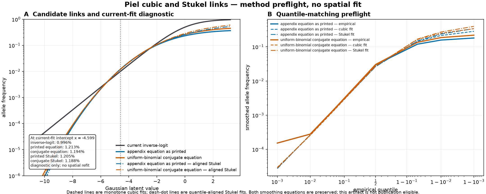

# Piel cubic and Stukel link preflight: do not advance to a spatial fit

Status: `automated_analysis` / `pending_expert_review`, 2026-09-16. Advances
[#103](https://github.com/bschilder/genomeOS/issues/103), Atlas design §§7–8, and
the [global modeling plan](../superpowers/plans/2026-09-09-global-af-modeling.md).
This is a method preflight, not a fitted surface or publication result.

## Scientific contract

The objective was to determine whether either Piel et al.'s unpublished empirical
cubic or Stukel's generalized logistic link is promising enough to justify another
full HbS spatial fit. The measurable output is a deterministic reconstruction under
both explicit readings of Piel's ambiguous smoothing equation. A candidate advances
only if it suppresses the diffuse non-endemic floor without making the weak-peak
problem worse.

The engineering component is the pure `genomeos.surfaces.piel_flexible_link`
module and offline `scripts/preflight_piel_flexible_link.py` runner. They emit
coefficients, aggregate curves and quantiles, source and input hashes, and a review
figure. They do not alter the production fitter, serve data, or make an artifact
publication eligible.

Piel's cubic coefficients are unavailable. The appendix also leaves details of its
empirical-CDF fit implicit and prints a smoothing equation that conflicts with its
stated uniform-prior binomial model. The reconstruction names every added choice and
preserves both equation arms. Stukel's positive-latent branch is outside the observed
HbS range, so its shape is fixed at the inverse-logit value zero and reported as
unfitted. A favorable preflight would still require a spatial fit with held-out count
and burden validation; an unfavorable result can avoid that compute.

## Frozen reconstruction

The private input contains 994 count-bearing Piel-comparable survey observations;
963 pass the appendix's `AN >= 50` threshold and 31 are reported as excluded. The
input SHA-256 is
`466034e22015ce5f4e0b90067adb2232491b625591d50c8ac83d955565345b4b`.
No row-level observation is committed.

The preserved smoothing rules are:

- appendix equation as printed: `(AC + 1) / (AN + AC + 2)`;
- uniform-binomial conjugate equation: `(AC + 1) / (AN + 2)`.

Each arm uses average ranks, Hazen plotting positions, a plug-in normal MLE on
smoothed logits, and five deterministic optimization starts. The cubic derivative is
a strictly positive floor plus the square of a line, so it is globally monotone.
Stukel uses the published two-piece transform. Its fitted negative-tail parameter is
`0.64441` under the printed equation and `0.44682` under the conjugate equation; all
five starts converge, and every fitted latent quantile remains below zero.

The Stukel fit has its own location and scale. It is evaluated at the same empirical
quantile as the inverse-logit baseline:

`z_stukel = μ_stukel + σ_stukel × (x_baseline - μ_logit) / σ_logit`.

This alignment prevents a raw latent value from being given two different empirical
meanings.

## Result

| Smoothing arm | Cubic logit RMSE | Stukel logit RMSE | Cubic at background | Stukel at background |
| --- | ---: | ---: | ---: | ---: |
| Appendix equation as printed | 0.19424 | 0.21247 | 1.2126% | 1.2046% |
| Uniform-binomial conjugate | 0.19459 | 0.21033 | 1.1939% | 1.1878% |

The current inverse-logit background at `x = -4.599069` is 0.9961%. Both cubic
reconstructions raise it by about 20%. The aligned Stukel candidates also raise it,
by 20.9% and 19.2%, while fitting the empirical logit quantiles worse than the cubic.

| Inverse-logit operating point | Printed-equation Stukel | Conjugate-equation Stukel |
| ---: | ---: | ---: |
| 5% | 5.404% | 5.465% |
| 10% | 9.087% | 9.377% |
| 15% | 11.995% | 12.543% |
| 20% | 14.480% | 15.292% |

The 20% point is a mild diagnostic extrapolation for the printed-equation arm,
whose maximum smoothed observation is 18.26%. The rejection already holds at the
10% and 15% points inside the observed range of both arms.

The two arms therefore give the same directional answer: Stukel raises the diffuse
background and compresses the peaks. It worsens both parts of the current
high-background, weak-peak failure.

The committed aggregate receipt and tables are in
[`piel-flexible-link-preflight-2026-09-16/`](piel-flexible-link-preflight-2026-09-16/).
The receipt records `spatial_fit_performed: false`,
`publication_eligible: false`, and an empty environmental-covariate list.

## Decision and source scope

Do **not** spend a GPU fit on either link now. This bounded negative result does not
prove that every joint refit must fail, because a spatial refit could move the latent
intercept and field. Revisit only with the original cubic coefficients, a fully
specified fitting procedure, or a model that separately targets low background and
localized peaks. Any candidate must beat the unchanged inverse-logit baseline on
held-out counts, calibration, supported-only national burden, and peak/background
contrasts.

This analysis grants no special status to the Malaria Atlas Project. The HbS surveys
are used because they contain count-bearing observations and instantiate the Piel
benchmark. MAP malaria-risk, vegetation, friction, and other modeled layers are not
inputs or implied next steps. Like every other covariate source, a named asset must
add out-of-region predictive value beyond simpler baselines under a pre-registered
comparison before it earns further work.

## Method sources

- Piel et al., *Lancet* 2013, doi:10.1016/S0140-6736(12)61229-X, Web Appendix 1.
- Stukel, *JASA* 1988, doi:10.1080/01621459.1988.10478613.
- The `sirt::pgenlogis` reference values are used as an independent executable test
  of the published Stukel transform.
