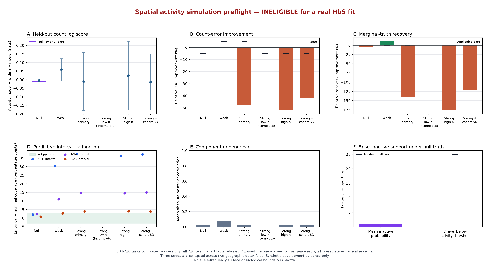

# Spatial activity simulation preflight, September 25, 2026

## TL;DR

The spatial activity model is **not eligible for a real HbS fit**. It passed the safety check when
the ordinary spatial model was the true model, but it failed the simulations it was designed to
solve. Under strong localized truth, its average absolute error was **41% to 52% worse**, recovery
of the true marginal frequency was **120% to 177% worse**, and its predictive intervals were much
too wide. Its score improved for positive counts but worsened for zero counts, so the extra spatial
activity process recreated the same support tradeoff seen in earlier rejected candidates.

All 720 registered task artifacts were retained. Of those, 704 fits completed successfully and 16
failed the convergence rule after the one allowed doubled-budget retry. The low-denominator
condition is therefore incomplete. The campaign records 21 preregistered refusal reasons and stops
before real data, as intended.

The six panels show only aggregate simulation evidence. No allele-frequency surface, biological
boundary, or measured-observation layer is drawn. A missing result is labelled `incomplete` rather
than represented by an unexplained symbol.

## What was tested

The candidate adds a spatial probability that an allele-generating process is locally active. It
integrates that probability into the count likelihood, so an observed zero is never classified as
known biological absence. The ordinary comparator uses the same beta-binomial spatial frequency
model without the extra activity field.

The frozen campaign used the real HbS survey coordinates, denominators, cohort structure, and
geographic split geometry, but generated new synthetic counts. It included:

- a null condition where the ordinary model is correct;
- weak and strong localized activity at the observed denominator scale;
- strong localized activity at 0.25× and 4× the observed denominators;
- strong localized activity with cohort heterogeneity;
- seeds 42, 43, and 44; and
- five geographic outer folds plus the registered inner-fold plans.

Both model arms used the same HSGP geometry, priors, sampler budget, count scorer, and held-out
rows. Every task was content-addressed in the registered 720-task manifest. A convergence failure
could retry once with twice the tuning budget; a second failure was terminal.

## Aggregate result

Positive log-score change favors the activity model. Positive MAE and recovery percentages would
also favor it; negative values mean the activity model was worse.

| Synthetic condition | Log-score change (95% interval) | MAE change | Marginal-truth recovery | 50/80/95% coverage | Result |
|---|---:|---:|---:|---:|---|
| Null | -0.00535 [-0.00908, -0.00163] | 0.39% worse | 4.87% worse | 52.13 / 82.36 / 95.93% | Passed the null safety limits |
| Localized weak | +0.05853 [-0.00653, +0.12359] | 0.22% worse | 10.77% better | 80.23 / 91.05 / 97.82% | Failed score certainty, MAE, and calibration |
| Localized strong, primary | -0.01082 [-0.18033, +0.15870] | **47.32% worse** | **139.92% worse** | 87.27 / 94.62 / 98.94% | Failed prediction, recovery, and calibration |
| Localized strong, low denominator | unavailable | unavailable | unavailable | unavailable | Incomplete after terminal convergence failures |
| Localized strong, high denominator | +0.02306 [-0.17777, +0.22389] | **52.17% worse** | **176.89% worse** | 86.10 / 94.51 / 99.01% | Failed MAE and calibration |
| Localized strong, cohort SD 0.5 | -0.01383 [-0.17807, +0.15040] | **41.38% worse** | **120.09% worse** | 87.06 / 95.06 / 98.93% | Failed score, MAE, and calibration |

The null result is a useful control. Its log-score interval stays above the registered -0.01 lower
bound, MAE and truth recovery remain within the allowed 5% loss, empirical coverage stays within
three percentage points of nominal, mean inactive probability is 0.86%, and only 0.046% of draws
fall below the activity-probability threshold. The model does not manufacture a large inactive
region when no activity gate exists in the truth.

That safety result does not establish usefulness. The weak condition's mean log score is positive,
but its interval still includes harm and its MAE does not improve by the required 5%. Its 50% and
80% intervals cover 80% and 91% of observations, showing severe overcoverage. The strong conditions
are worse: large error and truth-recovery regressions remain under ordinary denominators, larger
denominators, and cohort heterogeneity.

## The model helps positive counts by hurting zeros

The strong-condition strata explain why the aggregate result fails:

| Synthetic condition | Positive-count log-score change | Zero-count log-score change |
|---|---:|---:|
| Localized strong, primary | +0.70239 | **-0.19221** |
| Localized strong, high denominator | +0.88588 | **-0.19967** |
| Localized strong, cohort SD 0.5 | +0.80484 | **-0.18655** |

The activity field concentrates probability around positive observations, but the resulting count
distribution is worse where the observed count is zero. That is the same practical failure the
candidate was meant to avoid. A favorable positive-count score cannot rescue a model that worsens
global marginal prediction and absolute error.

Among converged fits, the mean absolute posterior correlation between the activity and conditional-
frequency components was low, from 1.96% to 7.33% across complete conditions. This makes strong
linear posterior dependence an unlikely explanation for the rejection. It does not prove that the
two latent processes have separate biological meanings; the registered claim concerned stable
marginal count prediction, and that prediction failed directly.

## Convergence and completeness

All 720 registered tasks produced a terminal artifact. There were 679 first-attempt fits and 41
fits that used the single allowed retry. Twenty-five retries recovered, while 16 fits still failed
because the sampler did not converge after the doubled budget.

Twelve of the 16 failures occurred in the low-denominator activity arm. The other four were
isolated inner-fold failures: one activity fit in the primary strong condition, one activity fit
with cohort heterogeneity, one ordinary fit in the weak condition, and one ordinary fit under null
truth. The low-denominator paired comparison is unavailable rather than computed from a selected
subset.

## Decision and next direction

Do not fit this activity model to real HbS data. Do not tune its priors, thresholds, or simulation
grid from these outcomes, and do not use more seeds to search for a favorable result. The current
B2 spatial GP remains the strongest completed comparator, although its real-data calibration and
the HbS burden parity gate remain unresolved.

This rejects the registered activity parameterization as the next model. It does not prove that
every possible nonstationary model is impossible. A future surface candidate would need a genuinely
different mechanism that improves zero-count and positive-count prediction together, preserves an
explicit unsupported state, and beats B2 on unchanged held-out counts. The broader program should
also continue its independent data gates: the clinically reviewed frozen variant set, the rs334
publication round trip, resident-frequency targets, and sealed external confirmation are still
open and are not solved by another spatial architecture.

## Scope and integrity

This is synthetic development evidence. It does not estimate a real allele frequency, validate a
biological boundary, satisfy HbS burden parity, or authorize publication of a surface. The public
JSON contains only the six aggregate comparisons, the decision, completion counts, and immutable
hashes. The 720 task artifacts, logs, input bundle, assembly, and full campaign result remain private
and untracked under `/private/tmp/activity-campaign-a53470f-20260924`.

The campaign used source revision `a53470f63199f60d1c20a838df228a3c36cbb8b4` and manifest
SHA-256 `6dad935bd9e1e2a3b9ea3946e985c5ebdd77ab0e4d2b3480b0438e7446c03712`.
The exact 720-artifact assembly ledger SHA-256 is
`920ddafc83b539a22fbd35689a4dcccd37d2af8fc6318febe137fd7b727484e2`; the sealed campaign-result
SHA-256 is `6ae61246bb8f711cfc2e81b26fcbe4c2298262581992f249a57e4a60c0c5758b`; and the finalization
receipt SHA-256 is `8a33a1d3af6eb45638fae2fa1c66b8b4077cb3a7c14745992373a675f265c725`.
Every task-owned RunPod was collected and deleted; the final pod was independently confirmed absent
through the RunPod API.

The first automated assembly attempt created no scientific result because its private supervisor
pointed one worker's checkpoint argument at `results` instead of `extracted/results`. The failed
logs were preserved, the path received a focused regression test, and the corrected run assembled
the same frozen artifacts without changing scientific code or thresholds.

One archived task JSON was accidentally printed by a broad local search for a worker connection
record before finalization. The task value was not used. The manifest, public decision rule,
aggregate reducer, and figure renderer had already been frozen and tested; the only later code
change was the checkpoint-path correction above. This incident is disclosed so the provenance
record does not overstate outcome blinding.

The aggregate JSON SHA-256 is
`6d68c9d99b6cee3f440820b2eab7f2e44cca276468789bf4365db94d718925b3`; the figure SHA-256 is
`d6934f35cfe6d6c1eb4430c241227b063d06203323d9e101deabc06717926aed`.
The plotting code is
[`scripts/plot_spatial_activity_preflight.py`](../../scripts/plot_spatial_activity_preflight.py),
and the compact machine-readable report is
[`spatial-activity-preflight-2026-09-25.json`](spatial-activity-preflight-2026-09-25.json).
