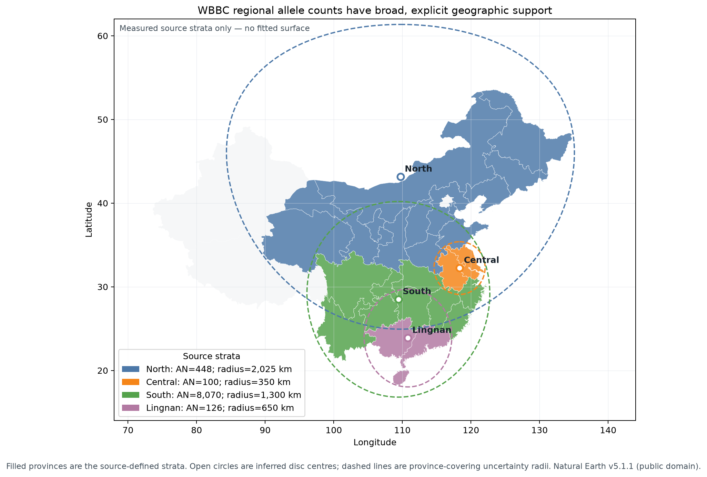

# WBBC regional-count qualification — 2026-09-17

Issue: [#325](https://github.com/bschilder/genomeOS/issues/325)

Design: Atlas §§4, 6 and 7.1

## Decision

The public WBBC GRCh38 WGS frequency release is eligible for **source-isolated P1 ingestion** for
an explicit curated variant set. It is not eligible to be combined with PGG.Han, ChinaMAP, NyuWa
or CMDB while participant independence remains unresolved in
[#326](https://github.com/bschilder/genomeOS/issues/326).

Each retained variant produces four measured-observation rows: North, Central, South and Lingnan.
The rows retain the source denominators (448, 100, 8,070 and 126 alleles) and the disease-enriched
cohort ascertainment:

```text
sampling_design = convenience
disease_ascertainment_excluded = false
cohort_id = wbbc:wgs-frequency-release-v1
```

Central and Lingnan remain in the observation store despite their small denominators. Support and
prior-dominance rules decide whether a later model can render them; ingestion does not silently
drop or pool them.

## Count derivation

WBBC reports regional `AF` and `AN`, but not regional `AC`. The reviewed derivation is
nearest-integer `AF × AN`, admitted only when both controls hold:

1. reported global `AC` equals nearest-integer global `AF × AN`; and
2. every retained regional product is within 0.005 of one integer.

The source's global genotype tallies provide a second independent check:
`RR + RA + AA = NS` and `RA + 2×AA = AC`. A violation of either identity is a hard error.

The full chr22 audit covered 1,091,904 records. Global reconstruction matched reported `AC` on
every record. The largest regional residual was 0.00425 alleles. The adapter repeats both controls
on every retained record and labels the assay `genome_frequency_reconstructed`.

## Geographic support

Region membership is transcribed from Cong et al. 2022 Supplementary Figure 1. Province geometry
comes from Natural Earth v5.1.1 `ne_10m_admin_1_states_provinces` (public domain), SHA-256
`22d0e3ad85eb3e27f17cabf8ba2d50e554fbc27a87796ff891d958185da62fb5`.

For each region, `scripts/plot_wbbc_regions.py` finds the minimax great-circle centre over all
member-province boundary vertices. The measured covering radius is rounded upward to the next
25 km. These are `location_type = inferred`; they are broad source supports, not claimed sampling
sites.

| Region | Representative coordinate | Measured radius | Stored radius | AN |
|---|---:|---:|---:|---:|
| North | 43.146298 N, 109.721579 E | 2,012.589 km | 2,025 km | 448 |
| Central | 32.235380 N, 118.341915 E | 343.134 km | 350 km | 100 |
| South | 28.503013 N, 109.420054 E | 1,290.252 km | 1,300 km | 8,070 |
| Lingnan | 23.876558 N, 110.815613 E | 647.817 km | 650 km | 126 |



The WGS cohort is highly imbalanced within these labels: Hunan and Jiangxi contribute 87% of WGS
samples. The release does not provide division-level counts, so the adapter does not invent a more
precise within-region location.

## Terms and privacy

The primary article is CC BY 4.0. The WBBC processed-frequency download page requests citation and
shows a general site copyright notice, but states no processed-data licence and no explicit
redistribution or commercial-use restriction. The completed summary-tier check is therefore
`no_restriction_found`, with `licence_not_stated` retained as a separate fact. Raw participant data
remain controlled and are outside this adapter.

The committed fixture is synthetic. No WBBC variant table, participant row or participant-linked
supplement is committed or published. The private participant supplement used to qualify aggregate
ascertainment was not used to build this adapter or figure and must remain private.

## Reproduction

```bash
python scripts/plot_wbbc_regions.py \
  --natural-earth /path/to/ne_10m_admin_1_states_provinces.geojson \
  --out-tsv docs/research/wbbc-regions-2026-09-17.tsv \
  --out docs/figures/wbbc-regions-2026-09-17.png
```

The generated TSV is byte-compared with the registry fixture in the test suite. Production builds
pass that reviewed TSV explicitly with `build_registry.py --wbbc-regions`; no coordinate or radius
has a runtime default.
