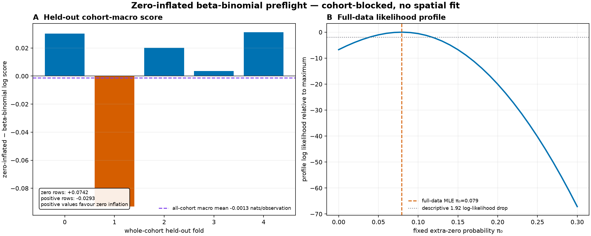

# Zero-inflated beta-binomial preflight: reject before a spatial fit

Status: `automated_analysis` / `pending_expert_review`, 2026-09-16. Advances
[#103](https://github.com/bschilder/genomeOS/issues/103), Atlas design §§7–8, and
the [global modeling plan](../superpowers/plans/2026-09-09-global-af-modeling.md).
This is a nonspatial development comparison, not a fitted surface or publication
result.

## Scientific contract

The objective was to test the next narrow explanation for the canonical HbS
surface's high non-endemic background: does an explicit absent component improve
held-out count prediction after the beta-binomial already represents ordinary
sampling zeros and survey overdispersion? The measurable output is a five-fold,
whole-cohort comparison of normalized count log probability. The predeclared gate
requires a positive cohort-macro score delta, no regression on positive-count
observations, improvement in at least four folds, and successful optimizer starts.

The engineering components are the pure
`genomeos.validation.zero_inflated_preflight` module and the offline
`scripts/preflight_zero_inflated_counts.py` runner. They evaluate vectorized exact
beta-binomial mass, deterministic multi-start scalar fits, whole-cohort fold
integrity, and an aggregate likelihood profile. They do not alter the surface
fitter, fit geography, or serve data.

An observed zero is never called structural absence. Under the candidate model,
its probability is the sum of extra absent mass and ordinary beta-binomial
sampling-zero mass. Positive counts retain beta-binomial mass multiplied by the
probability of being in the present component. The fitted extra-zero term is a
distributional component, not a reviewed population label. A favorable scalar
result would still require a separately specified spatial model and independent
validation; a failed result stops that expenditure.

## Frozen comparison

The private input has 994 count-bearing Piel-comparable observations. The declared
`AN >= 50` rule retains 963 rows from 384 cohorts: 200 zero counts and 763 positive
counts. Thirty-one excluded rows remain reported. The input SHA-256 is
`466034e22015ce5f4e0b90067adb2232491b625591d50c8ac83d955565345b4b`.
No row-level observation or cohort assignment is committed.

Whole cohorts are greedily balanced across five folds using the existing grouped
fold contract. A cohort appearing in more than one fold is a hard error. Every
observation is scored once. Count likelihoods use normalized mass, including the
binomial coefficient, so the two models are directly comparable on each held-out
count. All fits sort `(AN, AC)` before floating reductions and use fixed vectorized
optimizer starts.

## Result

| Held-out measure, zero-inflated minus beta-binomial | Delta (nats/observation) |
| --- | ---: |
| Cohort-macro mean | **-0.001328** |
| Row-weighted mean | **-0.007840** |
| Zero-count rows | +0.074161 |
| Positive-count rows | **-0.029335** |

Four folds have small positive cohort-macro deltas. The remaining fold has a
`-0.09309` delta and outweighs them. Every optimizer start succeeds, so this is
not a convergence refusal. The model fails two scientific gates: overall
cohort-macro prediction worsens, and probability is transferred away from positive
counts.

The full-data fit illustrates why in-sample likelihood would be misleading:

| Scalar fit | Conditional mean | Concentration | Extra-zero probability | Log likelihood | Marginal mean |
| --- | ---: | ---: | ---: | ---: | ---: |
| Beta-binomial | 4.3563% | 11.556 | 0 | -3936.644 | 4.3563% |
| Zero-inflated beta-binomial | 4.7490% | 13.481 | 7.935% | -3929.908 | 4.3722% |

The extra parameter gains 6.74 in-sample log-likelihood units and has a clear
profile optimum. It then raises the conditional mean enough that the marginal mean
is slightly **higher**, not lower. At `AN=2,000`, fitted zero-count probability
rises from 7.20% to 11.52%, but that gain is purchased by worse held-out probability
for the much larger positive-count stratum. These scalar concentration estimates
are not the canonical spatial fit's concentration and must not be interchanged.

The committed aggregate receipt, fold metrics, profile, and artifact copy are in
[`zero-inflated-count-preflight-2026-09-16/`](zero-inflated-count-preflight-2026-09-16/).
The receipt records `spatial_fit_performed: false`,
`publication_eligible: false`, and an empty list of environmental covariates.

## Decision and source scope

Do **not** build or run a spatial zero-inflated beta-binomial from this candidate.
The scalar absent component is a dead end for the observed failure: it improves
zeros in sample, harms positive-count generalization, and does not lower the
marginal mean. This does not reject every nonstationary model. A later candidate
must target low background and localized peaks directly, without relying on a
global probability-mass transfer, and must pass the unchanged cohort/spatial
held-out count gates before burden parity is consulted.

This experiment gives no priority to MAP as a source family. It uses count-bearing
HbS survey observations because they are the benchmark being diagnosed. MAP
malaria-risk, EVI, friction, and other modeled environmental layers are neither
inputs nor implied remedies. They remain WP3 candidates only if a named
variant-specific mechanism and controlled incremental comparison establish useful
information beyond the qualified baseline.
